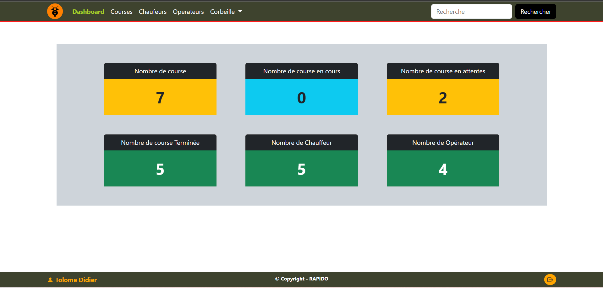
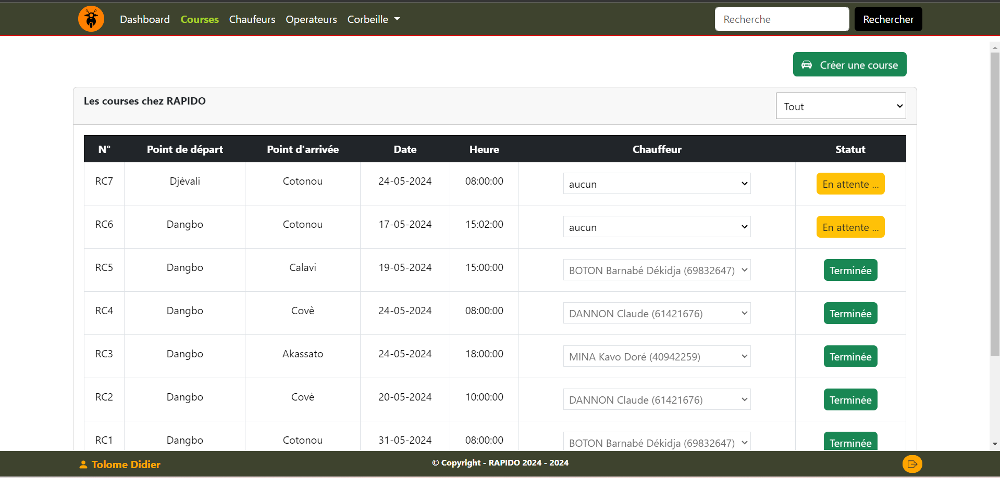
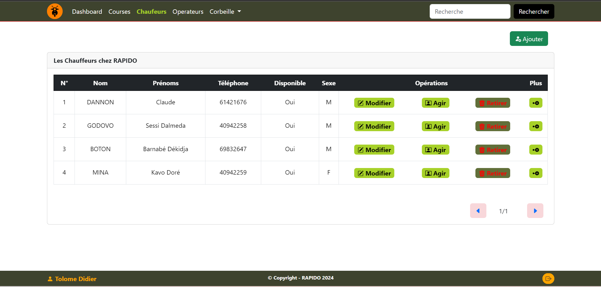
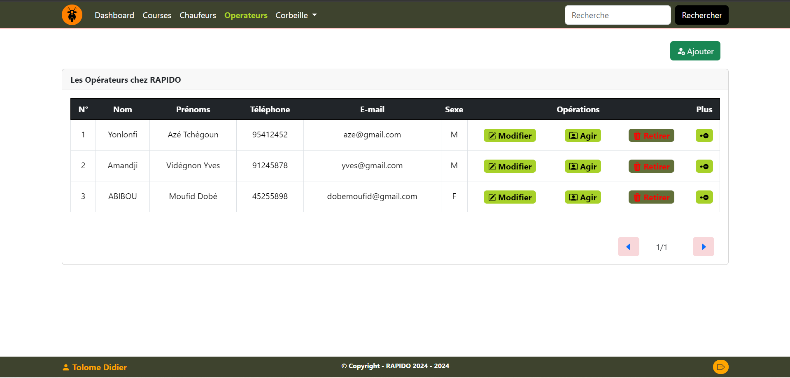
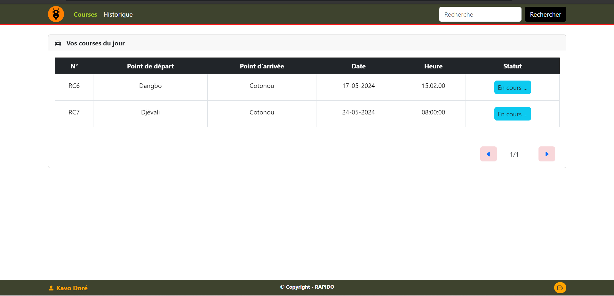
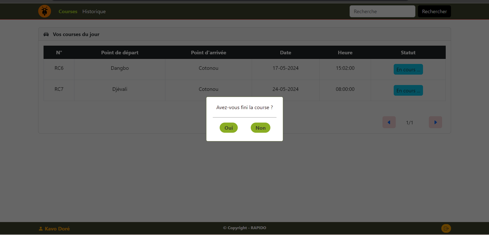
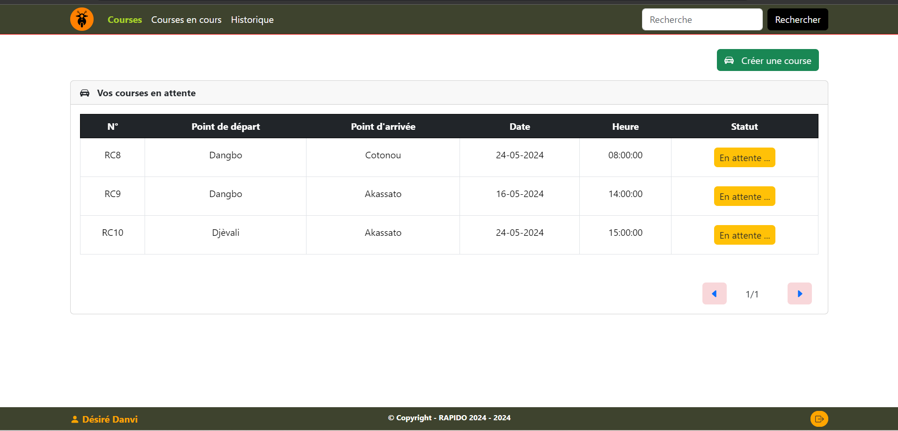
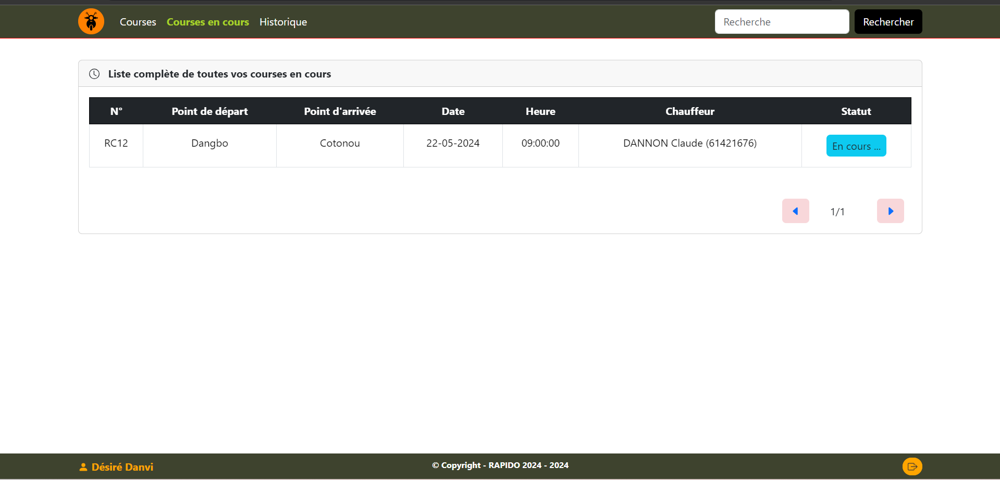
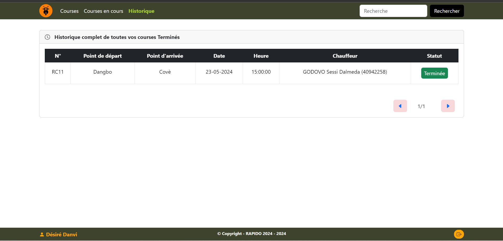

# Introduction

Dans un contexte où le secteur du transport interurbain connaît une croissance rapide et où la gestion efficace des courses et des chauffeurs est essentielle pour assurer un service de qualité, la société RAPIDO, spécialisée dans le transport interurbain par taxis, se trouve confrontée à un défi majeur. Le directeur de l'entreprise a confié à Koffi, un développeur web récemment recruté, la mission de concevoir et de développer une application web destinée à optimiser la gestion de cette activité.

Cette application doit répondre à plusieurs exigences fonctionnelles clés, telles que l'affichage des courses effectuées, l'ajout de nouvelles courses, l'affectation des chauffeurs disponibles et la mise à jour du statut des courses. Pour garantir le succès de cette application, il est crucial de concevoir une interface utilisateur simple et responsive en utilisant les technologies HTML5, CSS3, et éventuellement des frameworks comme Bootstrap. De plus, le back-end de l'application doit être développé en PHP afin d'interagir avec la base de données et de réaliser les opérations CRUD nécessaires. La base de données, pouvant être MySQL, MongoDB ou PostgreSQL, devra contenir des informations détaillées sur les courses et les chauffeurs.

En plus de ces exigences techniques, il est primordial de veiller à la sécurité du code PHP en protégeant contre les failles courantes telles que les injections SQL et l'échappement des entrées utilisateur. L'ensemble de ces éléments constitue une base solide pour développer une application efficace qui répond aux besoins de l'entreprise RAPIDO, tout en offrant une expérience utilisateur optimale et sécurisée.

# Présentation du sujet

## Présentation du Sujet

Le sujet de cet examen national de licence pour l'option Système Informatique et Logiciel (SIL) se focalise sur la conception et le développement d'une application web destinée à une entreprise de transport interurbain par taxis, RAPIDO. Dans un secteur où l'efficacité opérationnelle est primordiale, la direction de RAPIDO a confié à Koffi, un développeur web, la mission de créer une solution logicielle pour améliorer la gestion des courses et des chauffeurs.

## Contexte

RAPIDO opère dans un environnement compétitif où la gestion optimale des ressources humaines et matérielles peut faire la différence entre succès et échec. L'entreprise a identifié le besoin d'un outil digital capable de centraliser et d'automatiser plusieurs tâches essentielles. Ces tâches incluent la planification des courses, l'affectation des chauffeurs, le suivi en temps réel des trajets et la mise à jour des statuts des courses.

## Problématique

L'application doit répondre à des exigences spécifiques :

* Affichage des Courses : Présenter toutes les courses effectuées par les taxis, incluant des informations détaillées comme l'ID de la course, les points de départ et d'arrivée, la date et l'heure, le chauffeur assigné et le statut de la course (en cours, terminée).
* Ajout de Courses : Permettre à un opérateur d'ajouter de nouvelles courses en saisissant les points de départ et d'arrivée, ainsi que la date et l'heure prévues.
* Affectation des Chauffeurs : Faciliter l'affectation d'un chauffeur à une course en attente via une liste déroulante des chauffeurs disponibles.
* Mise à Jour des Statuts : Permettre la mise à jour du statut d'une course à "terminée" lorsque celle-ci est achevée par le chauffeur.

## Exigences Techniques
L'application devra être développée en utilisant :

* HTML, CSS : Pour créer une interface utilisateur simple et responsive, avec l'utilisation possible de frameworks CSS comme Bootstrap.
* PHP : Pour interagir avec la base de données et effectuer les opérations CRUD (Create, Read, Update, Delete).
* Base de Données : Utiliser MySQL, MongoDB ou PostgreSQL pour stocker les informations sur les courses et les chauffeurs, avec une structure de table définie.

## Sécurité et Bonnes Pratiques

Le code PHP devra être sécurisé pour prévenir les failles courantes telles que les injections SQL et les problèmes d’échappement des entrées utilisateur.

## Conclusion

Le projet proposé vise à doter RAPIDO d'une application web efficace et sécurisée, capable de gérer de manière centralisée et automatisée les opérations quotidiennes de l'entreprise. Cette solution contribuera à améliorer la performance opérationnelle de RAPIDO, assurant ainsi une meilleure satisfaction des clients et une utilisation optimale des ressources disponibles.

# Schéma relationnel de la base de données

Dans cette partie du document, nous allons explorer les schémas relationnels des tables créées pour le TP de développement web. L'objectif est de comprendre la structure de la base de données ainsi que les relations entre les différentes entités.

Une base de données bien structurée est essentielle pour garantir l'efficacité et la cohérence des opérations de stockage et de récupération des données.

## Le projet en question nécessite la gestion de plusieurs entités clés :

* les administrateurs,
* les chauffeurs,
* les opérateurs,
* et les courses.

Chacune de ces entités est représentée par une table dans la base de données, avec des relations bien définies pour assurer l'intégrité référentielle. Les tables sont conçues avec des clés primaires pour identifier de manière unique chaque enregistrement, et des clés étrangères pour établir des liens entre les différentes entités.

## Les tables créées sont les suivantes :

* admin_table : Contient les informations sur les administrateurs du système.
* chauffeurs : Contient les informations sur les chauffeurs, y compris leur disponibilité et leurs identifiants de création et de mise à jour par les administrateurs.
* operateurs : Contient les informations sur les opérateurs, avec un lien vers l'administrateur qui les a créés.
* courses : Contient les informations sur les courses, y compris les points de départ et d'arrivée, les chauffeurs et les opérateurs assignés, ainsi que les administrateurs qui ont créé et mis à jour les enregistrements.

## Schéma Relationnel

`` admin_table(admin_id, nom, prenoms, email, telephone, sexe, mot_de_passe, createdAt, updatedAt) ``

`` chauffeurs(chauffeur_id, nom, prenoms, telephone, sexe, disponible, mot_de_passe, email, retirer, admin_created_id, admin_updated_id, createdAt, updatedAt, FOREIGN KEY (admin_created_id) REFERENCES admin_table(admin_id), FOREIGN KEY (admin_updated_id) REFERENCES admin_table(admin_id)) ``

`` operateurs(operateur_id, nom, prenoms, telephone, sexe, mot_de_passe, email, retirer, creator_id, createdAt, updatedAt, FOREIGN KEY (creator_id) REFERENCES admin_table(admin_id)) ``

`` courses(course_id, point_depart, point_arrivee, date_heure, chauffeur_id, operateur_id, admin_created_id, admin_updated_id, statut, createdAt, updatedAt, FOREIGN KEY (chauffeur_id) REFERENCES chauffeurs(chauffeur_id), FOREIGN KEY (operateur_id) REFERENCES operateurs(operateur_id), FOREIGN KEY (admin_created_id) REFERENCES admin_table(admin_id), FOREIGN KEY (admin_updated_id) REFERENCES admin_table(admin_id)) ``

## Explications des Relations

### admin_table
* Cette table contient les informations sur les administrateurs.
* Chaque administrateur a un ID unique (admin_id) qui est utilisé comme clé primaire.

### chauffeurs
* Cette table contient les informations sur les chauffeurs.
* Chaque chauffeur a un ID unique (chauffeur_id) qui est utilisé comme clé primaire.
* admin_created_id et admin_updated_id sont des clés étrangères qui référencent admin_table(admin_id) pour enregistrer quel administrateur a créé ou mis à jour les informations du chauffeur.

### operateurs
* Cette table contient les informations sur les opérateurs.
* Chaque opérateur a un ID unique (operateur_id) qui est utilisé comme clé primaire.
* creator_id est une clé étrangère qui référence admin_table(admin_id) pour enregistrer quel administrateur a créé l'opérateur.

### courses
* Cette table contient les informations sur les courses.
* Chaque course a un ID unique (course_id) qui est utilisé comme clé primaire.
* chauffeur_id est une clé étrangère qui référence chauffeurs(chauffeur_id) pour enregistrer quel chauffeur est assigné à la course.
* operateur_id est une clé étrangère qui référence operateurs(operateur_id) pour enregistrer quel opérateur a géré la course.
* admin_created_id et admin_updated_id sont des clés étrangères qui référencent admin_table(admin_id) pour enregistrer quel administrateur a créé ou mis à jour les informations de la course.

# Réalisation

## Outils utilisés

Pour le développement de l'application web de gestion des courses et des chauffeurs pour RAPIDO, une variété d'outils et de technologies ont été utilisés afin d'assurer une solution robuste, sécurisée et performante. Voici une présentation des principaux outils utilisés :

## Langages de Programmation et Technologies Web

* HTML5 et CSS3 : Utilisés pour la création de l'interface utilisateur. HTML5 permet de structurer les contenus de manière sémantique tandis que CSS3 offre des styles avancés pour une mise en page attrayante et responsive.

* Frameworks CSS (Bootstrap) : Facilite la création d'interfaces utilisateur responsives et cohérentes, accélérant ainsi le développement front-end.

* PHP : Utilisé pour le développement du back-end. PHP permet d'interagir avec la base de données, de gérer les sessions utilisateurs et de réaliser les opérations CRUD nécessaires.

* MySQL : Choisi comme système de gestion de base de données relationnelle pour stocker les informations sur les courses, les chauffeurs, les opérateurs et les administrateurs. MySQL offre une fiabilité et des performances élevées.

## Environnement de Développement

* Visual Studio Code : Un éditeur de code puissant et extensible, utilisé pour écrire et organiser le code du projet. Ses fonctionnalités d'autocomplétion et ses extensions facilitent le développement.

* Git et GitHub : Utilisés pour la gestion de version et la collaboration. Git permet de suivre les modifications du code source, et GitHub offre une plateforme pour héberger et partager le code avec l'équipe de développement.
  
* Développement et Implémentation
  
* Le développement de l'application s'est déroulé en plusieurs phases clés :

## Conception de la Base de Données

La première étape a consisté à concevoir la base de données en utilisant MySQL. Les schémas relationnels ont été définis pour représenter les entités et les relations entre les administrateurs, les chauffeurs, les opérateurs et les courses.

## Développement du Front-End

Le front-end a été développé en utilisant HTML5, CSS3 et Bootstrap pour créer une interface utilisateur intuitive et responsive. Les pages de l'application incluent :

* Page d'authentification
  
* Page de gestion des courses : Permet d'afficher, d'ajouter et de mettre à jour les informations sur les courses.

* Page de gestion des chauffeurs : Permet d'afficher et de mettre à jour les informations sur les chauffeurs, ainsi que de gérer leur disponibilité.

* Page de gestion des opérateurs : Permet d'afficher et de gérer les opérateurs.

* Page de gestion des administrateurs : Permet de gérer les administrateurs du système.

## Développement du Back-End
Le back-end a été développé en PHP pour gérer les interactions avec la base de données MySQL. Les fonctionnalités incluent :

* Connexion et déconnexion des utilisateurs (administrateurs, opérateurs).

* Affichage des listes de courses, chauffeurs et opérateurs.

* Ajout, mise à jour et suppression des courses.

* Affectation des chauffeurs aux courses.

* Gestion de la disponibilité des chauffeurs.

* Sécurisation du code contre les injections SQL et autres vulnérabilités.

## Tests et Déploiement
Des tests unitaires et fonctionnels ont été réalisés pour garantir la qualité et la fiabilité de l'application. Les tests ont permis de vérifier le bon fonctionnement des différentes fonctionnalités et de corriger les éventuels bugs. L'application a ensuite été déployée sur un serveur web pour une utilisation en production.

# Conclusion
Le développement de cette application web pour la gestion des courses et des chauffeurs de la société RAPIDO représente une avancée significative dans l'optimisation des opérations de transport interurbain. En combinant une interface utilisateur intuitive et des fonctionnalités robustes de gestion des ressources, cette solution permet à RAPIDO d'améliorer son efficacité opérationnelle, de garantir un service de qualité à ses clients et d'optimiser l'utilisation de ses ressources humaines et matérielles.

La réalisation de ce projet a permis de mettre en pratique des compétences variées en développement web, en conception de base de données et en sécurisation des applications. Les technologies utilisées, telles que HTML5, CSS3, PHP et MySQL, se sont révélées efficaces pour répondre aux exigences du projet. Le respect des bonnes pratiques de développement et la rigueur dans la conception des schémas relationnels ont également contribué à la réussite de ce projet.

# Quelques captures :
## Page de connexion

## Administration

## Pages d'un Chauffeur

## Pages d'un Opérateur

